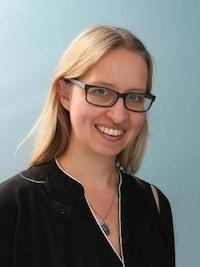

## Wo Sie uns finden

Die Veranstaltung findet via Zoom statt und beginnt jeweils um 18:15 Uhr.

Einwahl zur Veranstaltung über folgenden Link:

<https://lmu-munich.zoom.us/j/99426087417?pwd=TFlLUDUxZVJJZE5aUkJnVDRsdkNqUT09>

oder über Meeting-ID: 994 2608 7417 und Kenncode: 500167

## Wann wir uns treffen

**Montag** | **09.11.20**| **16. Jahrhundert** | **PD Dr. Anna-Katharina Höpflinger**
**Dienstag** | **17.11.20**| **17. Jahrhundert** | **Sr. PD. Dr. Nicole Grochowina**
**Mittwoch** | **25.11.20** | **18. Jahrhundert** | **Prof. Dr. Martin Keßler**
**Montag** | **30.11.20** | **19. Jahrhundert** | **Prof. Dr. Albrecht Geck**
**Dienstag** | **08.12.20** | **20. Jahrhundert** | **Dr. habil. Katharina Kunter**

Herzliche Einladung an alle Interessierten!

## Worum es geht

Martin Luther und Katharina von Bora wurden schon zu Lebzeiten zu beliebten Motiven besonders der Cranach-Schule. Doch die Bilder von ihnen sind nicht nur gegenständlich in den protestantischen Grundkanon aufgenommen. Aussprüche wie "Herr Käthe" präg(t)en Ideale von Frauen. Ebenso dien(t)en Luthertypisierungen als Beschreibung von teilweise dezidiert protestantischer Männlichkeit.

Ein Blick in die Forschungsgeschichte zeigt, dass bisher die Frage nach der Deutung Martin Luthers in den verschiedenen Jahrhunderten im Zentrum stand. Die Frage, wie Katharina von Bora im Verlauf der Jahrhunderte erinnert und interpretiert wurde und wie sie das jeweilige Frauenbild der Zeit prägte, spielte bislang keine maßgebliche Rolle.

In dieser Werkstattreihe werden Martin Luther und Katharina von Bora gewissermaßen als protestantisches Erzelternpaar nebeneinander gestellt und in ihrem Kontext verortet. Welche Charakteristika prägten die bildlichen und sprachlichen Darstellung von Martin und Katharina? Erfolgten Entwicklungen der Bilder in Korrelationen zueinander oder lassen sich Ungleichgewichte erkennen? Wer fand sich über die Jahrhunderte in diesen Bildern wieder und arbeitete an Aktualisierungen und Fortschreibungen mit?

An den fünf Vortragsabenden der Werkstattreihe stellen die Referierenden online zunächst ihre Ergebnisse in etwa 45 Minuten vor, bevor sie diese im Anschluss etwa 15 Minuten anhand von Quellen zur Diskussion stellen.

## Biographien der Referierenden

**Anna-Katharina Höpflinger** studierte Religionswissenschaft an der Universität Zürich, wo sie 2010 mit einer Arbeit über Drachenkampfmythen promoviert wurde. Neben Projektmitarbeiten in „Uncovering Gender“ in Neuchâtel und „Commun(icat)ing Bodies“ in Graz arbeitete sie zwischen 2011 und 2016 als Assistentin und Oberassistentin am Zentrum für Religion, Wirtschaft und Politik der Universität Zürich. Seit 2016 ist sie akademische Rätin an der LMU München. Sie habilitierte sich 2019 an der Universität Luzern. Ihre Forschungsschwerpunkte umfassen europäische und antike Religionsgeschichte, Medien und Religion, Körper, Kleidung und Gender, Bestattungskultur, sowie Religion und Heavy Metal.|

Weitere Informationen unter: <https://www.rw.evtheol.uni-muenchen.de/personen/wissenschaftliche-mitarbeiter/hoepfl/index.html>

**Nicole Grochowina** studierte Geschichtswissenschaft, Japanologie und Ethnologie in Hamburg. Mit einer Arbeit über konfessionelle Indifferenz und Dissidententum in Ostfriesland wurde sie 2001 promoviert. 2007 folgte die Habilitation für Neuere Geschichte an der Universität Jena mit einer Arbeit über Eigentums- und Besitzstreitigkeiten von Frauen Ende des 18. Jahrhunderts. Nach verschiedenen Lehrtätigkeiten in Jena und Erlangen, ist sie seit 2018 am Lehrstuhl für Neuere Kirchengeschichte an der FAU Erlangen-Nürnberg tätig. Ihre Forschungsinteressen beziehen sich unter anderem auf Fragen der Konfessionsgeschichte und der Frauen- und Geschlechtergeschichte. Seit 2008 ist sie Ordensschwester der Communität Christusbruderschaft in Selbitz.|

Weitere Informationen unter: <https://www.theologie.fau.de/institut-kg-landing/kg-2-neu/pd-dr-nicole-grochowina/>

**Martin Keßler** studierte evangelische Theologie in Heidelberg, Erlangen und München. Anschließend war er wissenschaftlicher Mitarbeiter an der Schiller-Universität Jena, bevor er 2006 über Johann Gottfried Herder promoviert wurde. Es folgten Tätigkeiten als Oberassistent für Kirchen- und Theologiegeschichte an der Universität Basel (2006–2009) und Assistent für Kirchengeschichte an der Georg-August-Universität Göttingen, wo er sich 2013 über das Bild Andreas Bodenstein von Karlstadts in der Forschung habilitierte. Er arbeitete an der Karlstadt-Edition und versah Lehrstuhlvertretungen in Bonn und Göttingen. 2018 bis 2020 hatte er eine Heisenberg-Professur in Frankfurt (Main) inne. Seit Anfang 2020 ist er Professor für Kirchen- und Theologiegeschichte an der Universität Basel.

Weitere Informationen unter: <https://theologie.unibas.ch/de/personen/martin-kessler/>

**Albrecht Geck** studierte Evangelische Theologie und Anglistik in Marburg, Münster und in Oxford und legte das 1. und 2. Staatsexamen für das Lehramt ab. 1996 wurde er mit einer kirchenhistorischen Arbeit über Schleiermacher als Kirchenpolitiker promoviert. 2008 habilitierte er sich an der Universität Osnabrück zu einer Arbeit über den Briefwechsel zwischen E. B. Pusey und F. A. G. Tholuck. Seit 2012 ist er außerplanmäßiger Professor an der Universität Osnabrück. Zudem ist er seit 2013 Mitglied der Kommission für Kirchliche Zeitgeschichte der Evangelischen Kirche in Westphalen. Er arbeitete zudem zur Bildnisgeschichte Luthers in den vergangenen fünf Jahrhunderten und entwickelte in diesem Kontext eine mobile Lutherausstellung mit dem Titel „Von Cranach zur Bildzeitung“.

Weitere Informationen unter: <https://www.ev-theologie.uni-osnabrueck.de/disziplinen/historische_theologie/apl_prof_dr_albrecht_geck.html>

**Katharina Kunter** studierte Evangelische Theologie und Geschichte in Gießen und Heidelberg und legte das 1. und 2. Staatsexamen für das Lehramt an Gymnasien ab. 1998 wurde sie mit einer Arbeit zu den Kirchen im KSZE-Prozess promoviert. 2004 erfolgte ihre Habilitation mit einer Arbeit über evangelische Kirchen in Deutschland zwischen Demokratie und Sozialismus. Nach Forschungs- und Lehraufenthalten in Aarhus und Tartu und Göttingen ist sie seit 2018 an der Theologischen Fakultät der Universität in Helsinki zunächst als Fellow, dann als Dozentin und seit August 2020 als Professorin für Kirchliche Zeitgeschichte tätig.

Weitere Informationen unter: <https://www.katharina-kunter.de/>

## Organisatorinnen

Carlotta Israel und Camilla Schneider

Wissenschaftliche Mitarbeiterinnen am Lehrstuhl Kirchengeschichte II

Evangelisch-Theologische Fakultät LMU München

<https://www.kg2.evtheol.uni-muenchen.de/>
